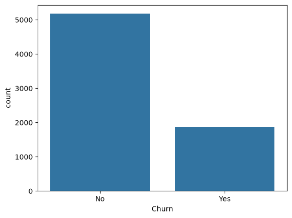
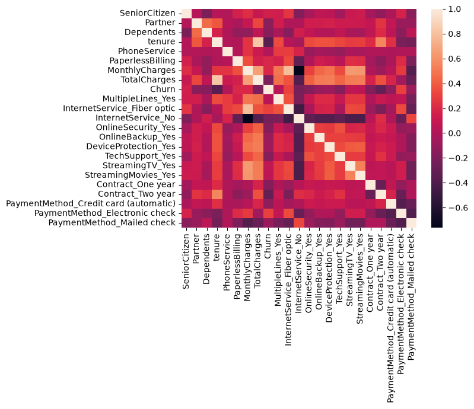
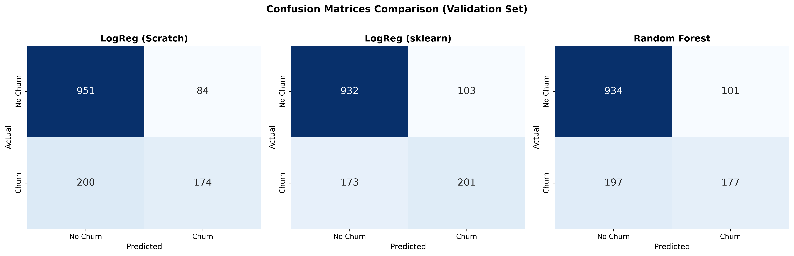
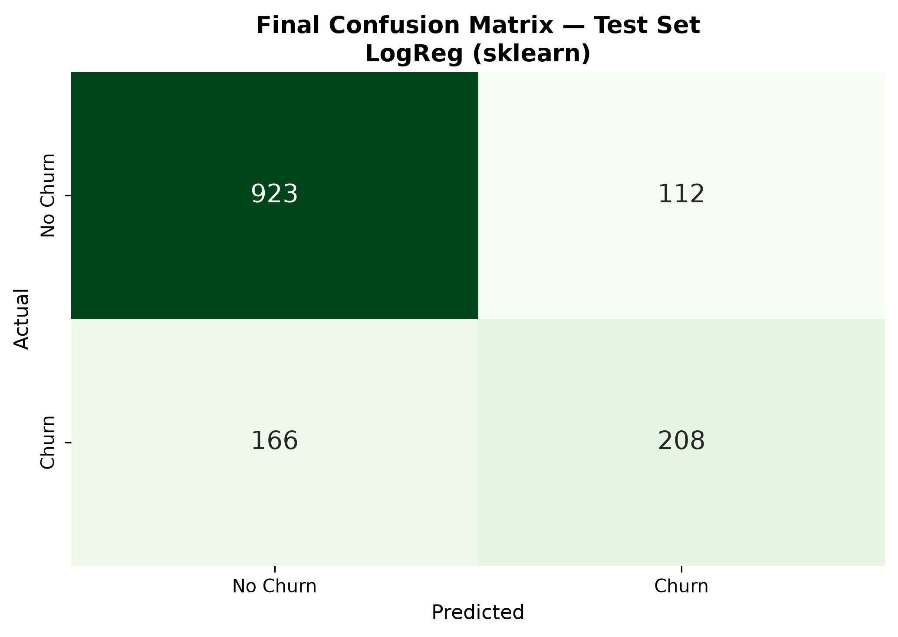

#  Customer Churn Prediction


<p align="center">
  
</p>


An end-to-end Machine Learning project that predicts customer churn using the Telco Customer Churn dataset. This project covers the complete data science workflow, including data preprocessing, exploratory data analysis (EDA), feature engineering, model development, hyperparameter tuning, and model evaluation.

---

##  Project Overview

Customer churn is one of the biggest challenges for subscription-based businesses. Predicting customers who are likely to leave allows companies to improve customer retention strategies and reduce revenue loss.

In this project, multiple machine learning models were developed and evaluated to classify whether a customer is likely to churn.

---

##  Objectives

- Understand customer behavior through exploratory data analysis.
- Clean and preprocess raw data.
- Handle missing values.
- Perform feature engineering.
- Train and evaluate multiple classification models.
- Compare model performance using classification metrics.
- Identify the most important factors affecting customer churn.

---

##  Dataset

**Dataset:** Telco Customer Churn Dataset

The dataset contains information about customer demographics, subscription details, billing information, and whether the customer churned.

Target variable:

- **Churn**
  - Yes
  - No

---

##  Exploratory Data Analysis (EDA)

Exploratory Data Analysis (EDA) was conducted to better understand customer behavior, identify data patterns, detect potential issues, and explore relationships between features before model development.

### Customer Churn Distribution

The target variable is moderately imbalanced, with most customers remaining subscribed while a smaller proportion have churned. This distribution was considered during model evaluation.

<p align="center">
  
</p>

---

### Feature Correlation Analysis

A correlation heatmap was generated to examine relationships between numerical and encoded categorical features. It helped identify variables that are more strongly associated with customer churn.

<p align="center">
  
</p>

---

##  Technologies Used

- Python
- Pandas
- NumPy
- Matplotlib
- Scikit-learn
- Jupyter Notebook

---

##  Project Workflow

1. Data Understanding
2. Data Cleaning
3. Exploratory Data Analysis (EDA)
4. Feature Engineering
5. Data Preprocessing
6. Train / Validation / Test Split
7. Feature Scaling
8. Model Training
9. Hyperparameter Tuning
10. Model Evaluation
11. Performance Comparison

---

##  Machine Learning Models

The following models were implemented:

- Logistic Regression (From Scratch)
- Logistic Regression (Scikit-learn)
- Random Forest
- Random Forest with GridSearchCV

---

## Model Evaluation

Four classification models were implemented and evaluated throughout this project:

- Logistic Regression (Implemented from Scratch using NumPy)
- Logistic Regression (Scikit-learn)
- Random Forest (Hyperparameter Tuning)

### Validation Set Comparison

The confusion matrices below compare the performance of the implemented models on the validation dataset.

<p align="center">
  
</p>

---

### Final Model Performance

After comparing all models, the best-performing model was evaluated on the unseen test dataset.

<p align="center">
  
</p>

The final model demonstrated strong predictive performance while maintaining a good balance between identifying customers who are likely to churn and those who are expected to stay.

---

##  Repository Structure

```text
Customer-Churn-Prediction
│
├── data
│   ├── raw
│   └── processed
│
├── notebooks
│   └── Customer_Churn_Prediction.ipynb
│
├── images
│
├── README.md
├── requirements.txt
└── .gitignore
```

---

##  Future Improvements

- Deploy the model as a web application.
- Build an interactive dashboard.
- Experiment with XGBoost and LightGBM.
- Perform model explainability using SHAP.

---
